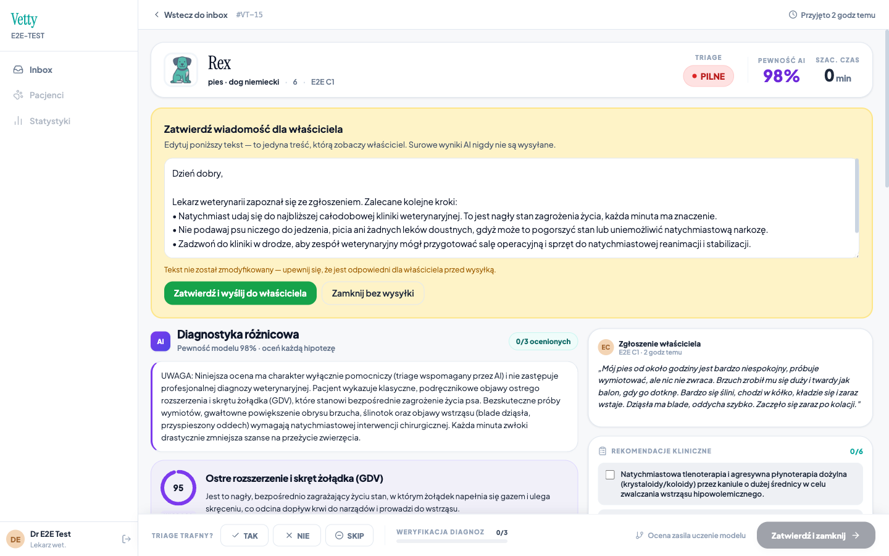
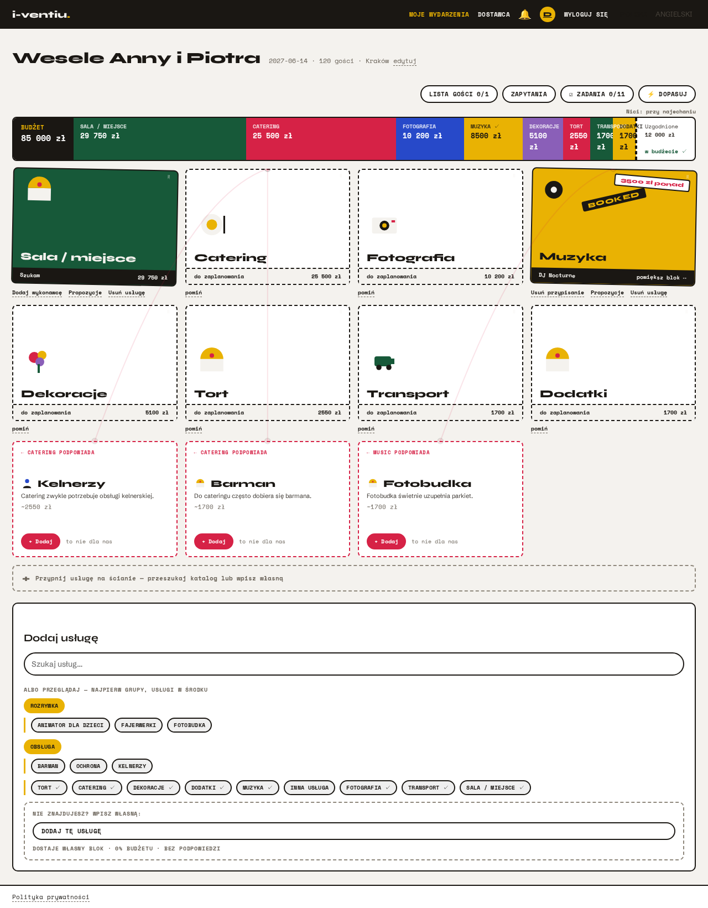
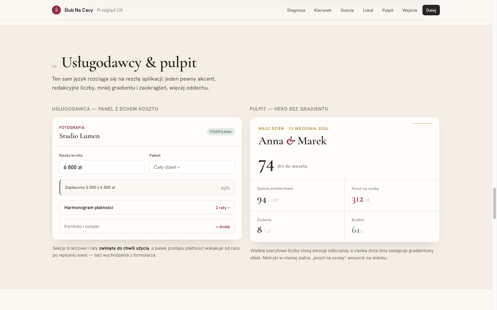

# Portfolio — mozdowski

  
  

  
  
  

Six production-grade products, built solo, end to end: product design, backend, frontend, ML/AI, security, compliance and ops. The source is private — these are commercial SaaS candidates — but each case study below documents the architecture and engineering decisions, and **read access to any repo can be arranged for interview processes on request**.

## Projects

| Project | One-liner | Stack highlights |
|---|---|---|
| [Vetty](projects/vetty.md) | AI veterinary triage for clinics, with a mandatory vet-in-the-loop release gate | FastAPI, Gemini/Vertex AI (EU-pinned), CLIP, eval harness with LLM-judge consensus |
| [AIdwokat](projects/ai-dwokat.md) | Regulatory-change early warning for Polish businesses (*vacatio legis* window) | FastAPI, pgvector, hybrid RAG + reranking, Celery, Anthropic Message Batches |
| [i-ventiu](projects/i-ventiu.md) | Configurator-first event planning — PC-part-picker mechanics for events | Django, OR-Tools CP-SAT solver, PostGIS, React, custom design system |
| [Wedding Master Plan](projects/wedding-master-plan.md) | Wedding planning command center with a venue cost engine and seating chart | React, FastAPI, field-level encryption, GDPR subsystem, Stripe |
| [Pełnia](projects/sovereign.md) | Privacy-first symptothermal fertility tracker — no network layer at all | Flutter, SQLCipher, on-device LSTM (TFLite), Bayesian inference |
| [Unbound Mind](projects/unbound-mind.md) | Offline-first OCD self-help app with hardware-bound encryption | Flutter, native AndroidKeyStore key management, AES-GCM, zero INTERNET permission |

## Recurring themes

**Security & privacy engineering.** Field-level encryption with zero-downtime key rotation; refresh-token rotation with theft detection; hardware-bound keys behind live biometric checks; two apps that ship with *no network permission whatsoever*, making their privacy claims externally verifiable; fail-closed input gatekeeping for LLM pipelines.

**Evaluation-driven AI.** Both AI products gate changes on frozen golden datasets with measured metrics — triage accuracy 55% → 77% in one, retrieval recall@10 0.78 → 0.96 in the other — including honestly recorded negative results and eval-discovered production bugs.

**Compliance as code, not documentation.** GDPR data-subject rights as real tested endpoints, consent hashing, retention sweeps, EU data-residency pinning enforced by tests, EU AI Act machine-readable marking.

**Test depth unusual for solo work.** Roughly 1,500+ automated tests across the six projects, with test-to-source ratios approaching 1:1 in several, regression tests named after specific incidents, and self-verifying demo pipelines where a recorded marketing video doubles as a passing integration test.

## Open source

Generic pieces extracted from these projects, each with full test suites:

- [sentry-pii-scrub](https://github.com/mozdowski/sentry-pii-scrub) — mirrored Python + TypeScript PII scrubbers for Sentry: one reviewable policy (headers, bodies, cookies, URLs, stack-frame locals, breadcrumbs, user identity) enforced in both runtimes. 39 tests.
- [flutter-auth-bound-key-store](https://github.com/mozdowski/flutter-auth-bound-key-store) — auth-bound data-encryption keys for Flutter on Android: AndroidKeyStore key requiring a live biometric/device-credential check on every use, unwrapped only inside a `BiometricPrompt.CryptoObject`. Built after verifying on-device that a popular plugin's "biometric" mode silently dropped the auth requirement.
- [retrieval-eval-kit](https://github.com/mozdowski/retrieval-eval-kit) — gate RAG/retrieval changes on a frozen golden set: recall@k, precision@k, MRR, baseline comparison. Zero dependencies. 36 tests.
- [tristate-predicates](https://github.com/mozdowski/tristate-predicates) — declarative JSON rules evaluated with explicit indeterminacy as a first-class result; the fail-open vs fail-closed pattern. Zero dependencies. 69 tests, verified equivalent to the production original across a 28,800-case differential run.
- [playwright-demo-recorder](https://github.com/mozdowski/playwright-demo-recorder) — record narrated, subtitled product demo videos from Playwright scenarios that assert their flow's business outcome: a clip that records is a flow that works; a broken flow exits non-zero and delivers no video.
- [ssh-control-mcp](https://github.com/mozdowski/ssh-control-mcp) — MCP server for SSH control.

## Contact

GitHub: [@mozdowski](https://github.com/mozdowski) · Email: vasco.ozdowski829@gmail.com
