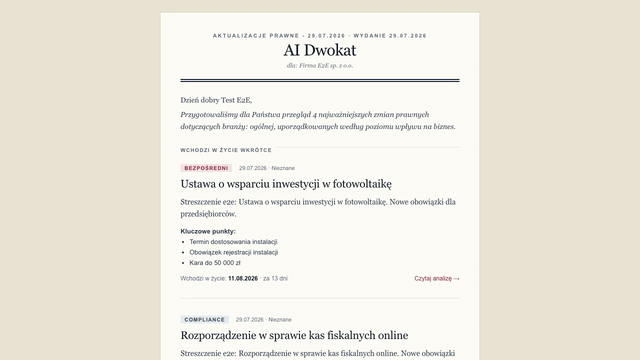
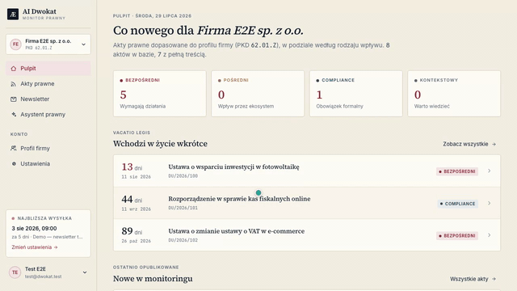

#  AIdwokat — regulatory-change early warning for Polish businesses

> **Status:** Private MVP in development · **Code:** private, available on request · **Role:** solo design, development, ML/RAG engineering

A legal-monitoring SaaS that watches official Polish legal acts (Dziennik Ustaw, Monitor Polski) through the government ELI API, scores each act's relevance to a specific business, and delivers a personalized email newsletter. The product bet: the valuable moment is the ***vacatio legis* window** — laws already published but not yet in force — so the newsletter leads with "entering into force soon", sorted by countdown, letting a business prepare before a regulation bites. Businesses are profiled against **PKD 2025**, the official Polish activity classification (728 subclasses). A paid-tier RAG assistant answers legal questions with mandatory source-act citations and a not-legal-advice disclaimer.

## Tech stack

| Layer | Technologies |
|---|---|
| Backend | Python, FastAPI, SQLAlchemy 2 (sync + async), PostgreSQL + pgvector, Celery + Redis, Alembic (30 migrations) |
| ML / RAG | bge-m3 embeddings (1024-d), Postgres FTS + dense hybrid search, Reciprocal Rank Fusion, cross-encoder reranking, Claude via Anthropic SDK |
| Document pipeline | PyMuPDF, OCR fallback (Tesseract), LLM contextualization & summarization via Message Batches |
| Frontend | Next.js 15 (App Router), React 19, TypeScript, Tailwind, TanStack Query, hand-built UI kit, generated OpenAPI types |
| Testing | pytest (93 test files), Vitest + MSW (115 files, colocated), Playwright E2E (28 specs) |

## Engineering highlights

**A retrieval eval harness that gates releases with real numbers.** A frozen 50-query golden set with pure metric functions (recall@k, precision@k, MRR) gates every retrieval-stack change. The measured migration: **recall@10 went 0.78 → 0.95** swapping MiniLM+BM25 for bge-m3 + Postgres FTS hybrid search, then **0.963 with MRR 0.903** after adding a cross-encoder reranker — each step A/B-verified against the same frozen set. Building the eval also paid for itself directly: it surfaced five latent defects in the pipeline, including a corpus ingestion gap and a reranker memory blow-up that would otherwise have degraded quality silently.

**Resumable, idempotent ingestion built around a ledger.** Every act moves through an eight-step pipeline (extract → chunk → contextualize → embed → summarize → finalize) keyed by `(act, step, content-hash)`. A completed step is a no-op on retry, a killed worker resumes from the last completed step, and a *re-published* act correctly re-processes while unchanged acts don't — idempotency by content, not just by ID.

**Batch-first LLM economics.** All ingest-time LLM work (contextualization, summaries, key points) routes through Anthropic's Message Batches API for 50% cost reduction, accepting up to 24h turnaround. The Celery pipeline is designed around that asynchrony: submit steps end the chain, a beat task polls, collect steps resume it. Synchronous paths remain for interactive requests only.

**Explainable-by-design relevance matching.** PKD matching deliberately uses no ML model — an auditable keyword-stem approach derived from the official taxonomy, chosen so that "why did I get this alert?" always has a concrete answer (the shared stems), at a documented cost in paraphrase recall. In a legal product, explainability of alerts is a feature, not a compromise.

**Graceful degradation as a consistent posture.** The ~2 GB cross-encoder lazy-loads off the event loop and falls back to hybrid-search order on any failure rather than erroring; the degraded mode has its own scripted demo scenario. A production-breaking OOM (unbounded rerank input on long legal chunks) was caught by the live eval and fixed with hard input caps.

**Privacy-conscious details throughout.** The frontend's validation-error handler extracts only field paths from API 422 responses, deliberately dropping server prose and the user's rejected input so neither can leak into the UI or logs.

## Scale & quality

~86,000 lines of hand-written code: ~40,000 backend, ~9,000 frontend source, and a genuinely unusual test footprint — roughly **1:1 test-to-source ratio on both sides** (15,500 backend test LOC, 9,700 frontend unit + E2E). Seven narrated demo scenarios recorded via a scripted Playwright pipeline (video + subtitles + narration script per flow).

## In motion

*Seeded demo data.*

The generated newsletter — "entering into force soon" leads, sorted by countdown (the product promise):

Dashboard → act detail with relevance rationale:

