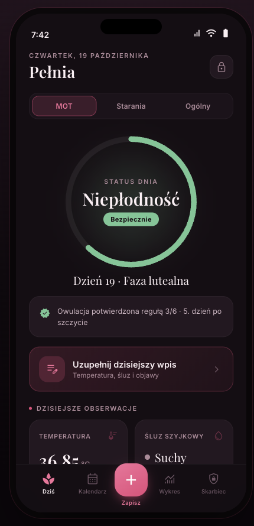
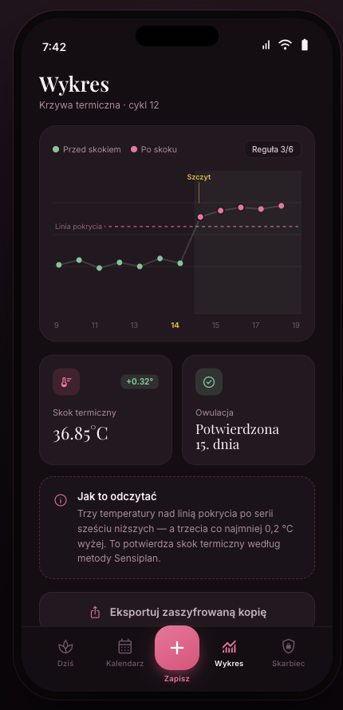
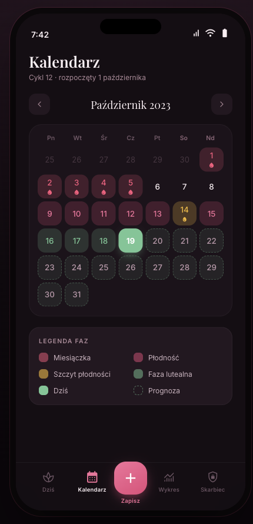

# Pełnia (Sovereign) — privacy-first fertility awareness app

> **Status:** Private, in personal use · **Code:** private, available on request · **Role:** solo design, development, ML & security engineering
>
> *Not medical advice and not a medical device. Described functionality follows the Sensiplan symptothermal methodology with a deliberately conservative failure mode.*

A local-only menstrual and fertility tracker implementing the Symptothermal Method (Sensiplan). Fertility apps demand the most intimate health data a person has — and mainstream ones monetize it. Pełnia keeps full symptothermal tracking on-device: AES-256 encrypted storage, no cloud, no accounts, and **no network layer at all** — the Android manifest requests no `INTERNET` permission, which makes the privacy claim externally verifiable.

## What it does

- Three operational modes that reframe the entire UI: neutral tracking, trying-to-conceive, and natural family planning
- NFP mode drives a red/yellow/green fertility traffic light that is **conservative by design** — red whenever data is insufficient or ovulation is unconfirmed; ambiguity always resolves toward "fertile", never toward "safe"
- BBT charting, daily symptom logging, calendar with predicted fertile windows
- PIN + biometric unlock, privacy curtain when the app backgrounds, root/jailbreak refusal, encrypted-only export

## Tech stack

Flutter/Dart · Riverpod · SQLCipher (AES-256) · TensorFlow Lite (on-device inference) · fl_chart · flutter_secure_storage · local_auth

## Engineering highlights

**Sensiplan symptothermal engine with a single source of truth.** The cycle-evaluation service implements Sensiplan's temperature and mucus double-check rules; the computed infertility date is one shared gate consumed by both the dashboard ring and the calendar painter, so the two surfaces are structurally incapable of disagreeing.

**Hybrid on-device prediction — two independent models, no server.** An LSTM trained on an open research dataset ships as a 48 KB TFLite asset with a documented cold-start degradation path (statistical mean → padded LSTM → full-history LSTM). Alongside it, a **Bayesian conjugate-prior model** (Normal-Inverse-Gamma) maintains a posterior over the user's luteal-phase length, starting from the population prior and updating after each confirmed ovulation — the posterior's variance directly sets the width of the predicted fertile window. Personalized Bayesian inference, running entirely on a phone.

**Fail-closed data recovery.** A dependency update flipped a storage plugin's default to "silently delete everything on any decrypt error" — which would have destroyed the database encryption key on a transient failure. The fix pins the safe behavior and routes all failures to an explicit user-facing recovery screen: destructive recovery happens only after the user double-confirms, never by a service's silent decision. The failure taxonomy is a separately tested pure function.

**DST-exact date arithmetic.** All cycle math is normalized to UTC civil dates, because naive local-time arithmetic truncates a day across DST transitions — and in an app where a one-day error shifts a contraceptive safety window, that's a correctness requirement, not a nicety.

**Release-only race condition, diagnosed and documented.** A Riverpod provider chain produced an infinite spinner *only in release builds* — a timing-dependent race where a loading→data transition mid-build invalidated the in-flight future. The fix (explicit invalidation over reactive cascades) is documented in-code with the full rationale.

## Scale & quality

~9,000 lines of Dart application code, **240 tests, all passing** — including unit tests for the cycle-evaluation and Bayesian models cross-checked against a Python reference implementation, and regression tests named after specific incidents. ~18,600 lines of design and planning documentation.

## Screens

*From the design prototype — "Midnight Rose" dark theme, synthetic data.*

  
  
  

