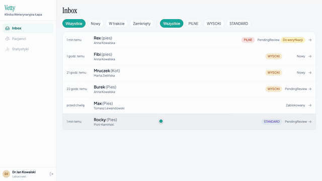
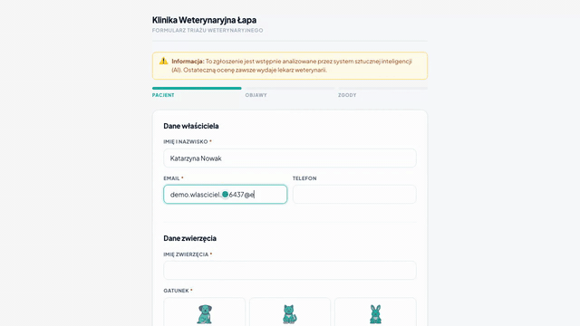
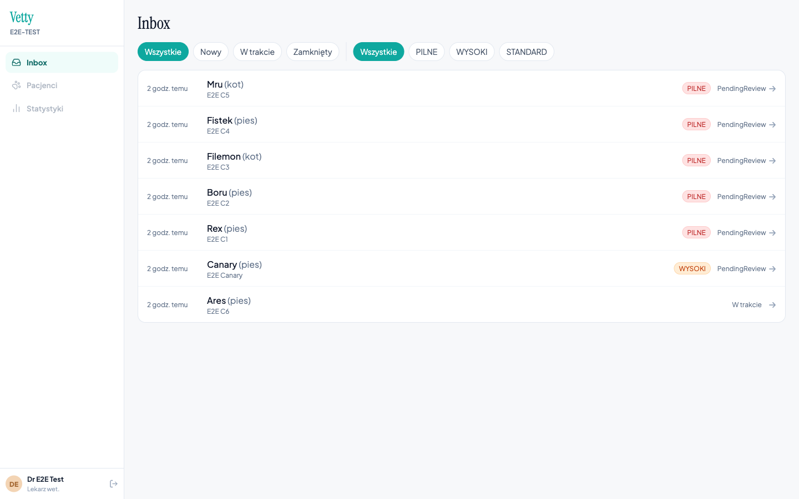
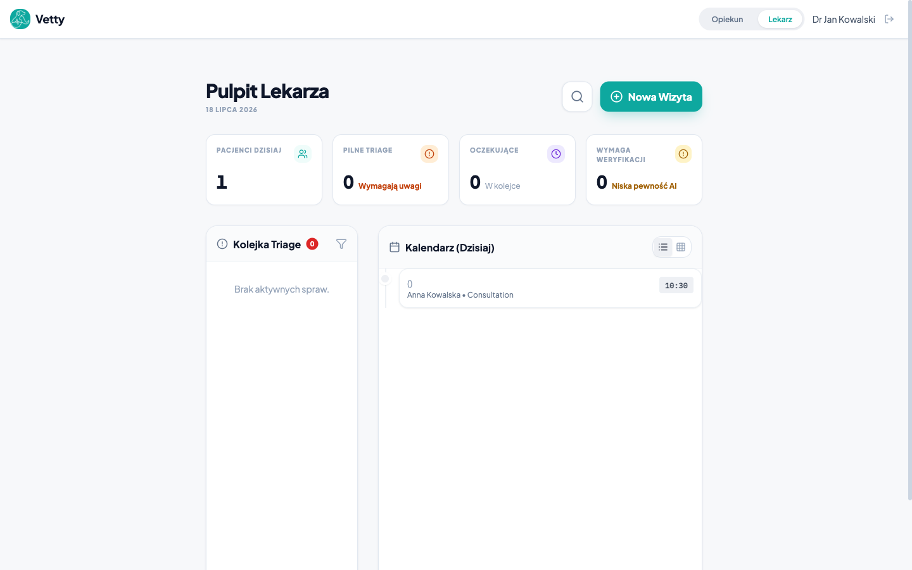
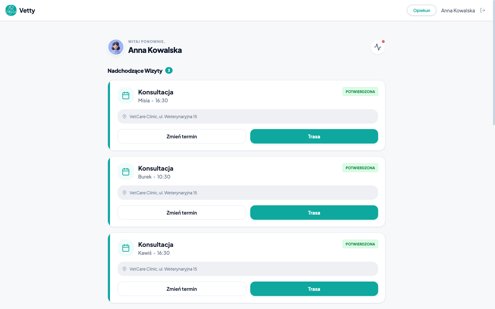

# Vetty — AI-powered veterinary triage for clinics

> **Status:** Private SaaS (pilot-ready) · **Code:** private, available on request · **Role:** solo design, development, AI engineering & compliance

An AI triage platform sold to veterinary clinics (Polish market). A clinic embeds an intake form on its website; a pet owner describes symptoms and attaches photos, videos or documents; a multi-stage AI pipeline produces differential diagnoses, a triage level and recommended actions. **The AI output never reaches the owner directly** — a licensed vet reviews every analysis and must explicitly release it with a personally edited summary, or reject it. That vet-in-the-loop gate is a regulatory requirement (Polish veterinary chamber) engineered as a hard state-machine constraint, not a UI suggestion.

## What it does

- Embeddable intake form with an interactive, zoomable **body map** — tap where the problem is, coarse zones reveal sub-zones
- AI pipeline: intake extraction → diagnosis → research → critique loop → dedicated triage classifier
- Vet panel: case inbox, tearsheet, release/reject workflow, structured feedback feeding an active-learning loop
- Clinic administration: onboarding, hashed API keys, usage stats
- Multi-tenant by clinic, with dedicated isolation test suites

## Tech stack

| Layer | Technologies |
|---|---|
| Backend | Python 3.12, FastAPI, SQLModel, Alembic, PostgreSQL, Redis |
| AI | Gemini via Vertex AI (pinned to an EU region for data residency), local sentence-transformers + CLIP, Langfuse observability |
| Frontends | 3 React 19 + TypeScript apps (embed form, vet panel, admin), TanStack Query, Tailwind |
| Infra | Docker Compose, GitHub Actions CI (secretless — SQLite + mocked ML for test runs), S3/MinIO behind a `Protocol` storage seam |

## Engineering highlights

**An evaluation harness that actually moved the numbers.** Golden datasets built from veterinary literature (136 cases across triage levels), expanded by LLM into variants across five owner personas — panicked and brief, broken grammar, verbose googler, colloquial, formal — in two languages, holding clinical facts constant while varying only wording. Scoring combines deterministic metrics with a 3-model LLM-judge consensus, tracked as versioned baselines with explicit safety thresholds. Measured results: **overall triage accuracy 55% → 77%, Polish-language accuracy 60% → 88%, under-triage rate 0.77% against a <5% threshold, zero gatekeeper false negatives.** Negative results are recorded too — one batch of few-shot changes was tested and reverted because gains at one severity level caused regressions at an adjacent one.

**A 4-stage fail-closed security gatekeeper** for user-submitted content: input sanitization (Unicode normalization *before* pattern matching, zero-width character stripping, file magic-number validation), a semantic relevance router on sentence embeddings, an LLM-based injection classifier, and a file validator with CLIP-based image relevance checks — including a heuristic that catches injection payloads rendered as images of text. Any stage that detects a threat *or itself throws* blocks the submission.

**Uncertainty-driven cost gating with an asymmetric safety rule.** Expensive pipeline stages (strong-model critique, research) are skipped only under a conjunction of confidence conditions — and *never* for elevated triage levels, because under-triage is the catastrophic failure mode. Cheap where it's safe, thorough where it matters.

**Structural safety by construction.** Body-map selections are whitelist enums, never free text — the one input allowed outside the prompt's user-data fence. The zone registry is mirrored across Python and TypeScript, and a test parses the TypeScript source and diffs the registries byte-for-byte so they cannot drift.

**Compliance as code.** GDPR data-subject rights are real endpoints (export, erasure/anonymization, consent withdrawal), consent is recorded as a hash over its full context, retention is per-clinic with an anonymize-on-expiry sweep, and EU AI Act machine-readable AI marking ships in every analysis. All of it is enforced by tests — EU region pinning, PII minimization in observability, consent enforcement, retention sweeps.

## Scale & quality

~32,000 lines of application code: a layered FastAPI backend (~12,800 LOC excluding tests), three frontend apps (~12,400 LOC), 308 backend test functions (~6,700 LOC), 8 migrations, CI on every push, 526 commits. Six narrated demo videos recorded via scripted Playwright scenarios.

## In motion

*All data shown is synthetic seed data (E2E test clinic).*

The full vet-gate arc — case inbox → AI tearsheet → vet edits the owner summary → release ("raw AI results are never sent" is the product thesis):

Owner intake wizard (embeddable form):

## Screenshots

| Vet inbox — triage-sorted | Tearsheet with release panel (the vet gate) |
|---|---|
|  |  |

| Vet dashboard | Owner dashboard |
|---|---|
|  |  |
